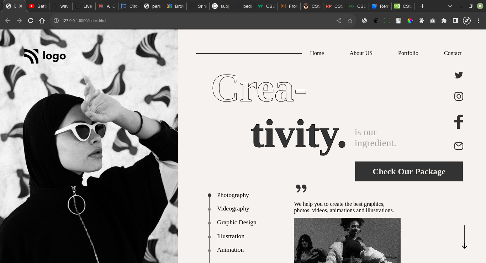

# Project14 [live link](https://css-projects-14.netlify.app/)

## By - Karan Chauhan

- CSS property I learned in this project
    - use of FontAwesome icon in pseudo element
    - `::marker` pseudo element
    - flexbox
    - `text-stoke`

## Time taken to complete this project
    - 5 hours + 1 hour (responsiveness)

## Screenshot
